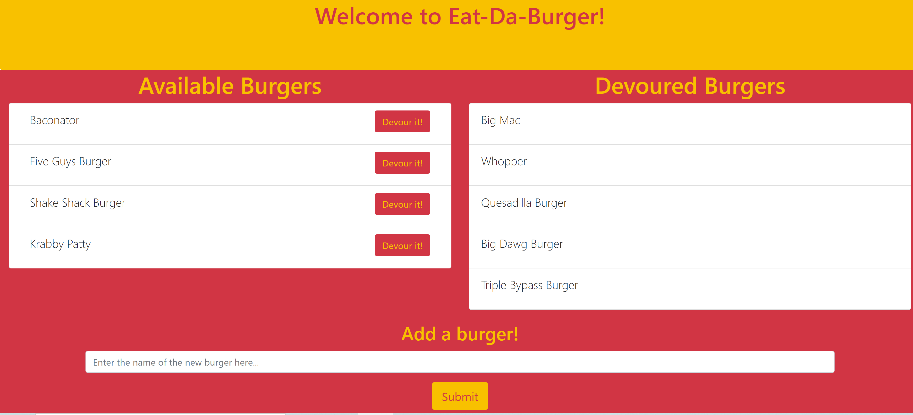

# Eat-Da-Burger App
This application was created so a user can manipulate a SQL database on a live webpage. A user is able to add new burgers to the page and can also decide whether the burger is consumed or not.

## Deployed Link
https://burger-app-0100.herokuapp.com/

---

---

## How this App Works
When the user opens the webpage, they will be able to view burgers that are available, burgers that have been devoured, and at the bottom of the page a user can add a new burger. When a user adds a new burger, the page will be refreshed and the new burger will be displayed in the available table. Each burger in the available table has a button next to it which when clicked will be sent to the devoured table. 

## Technologies Used
* JavaScript
* Node.js
* Express.js
* Handlebars.js
* JQuery
* HTML
* Bootstrap